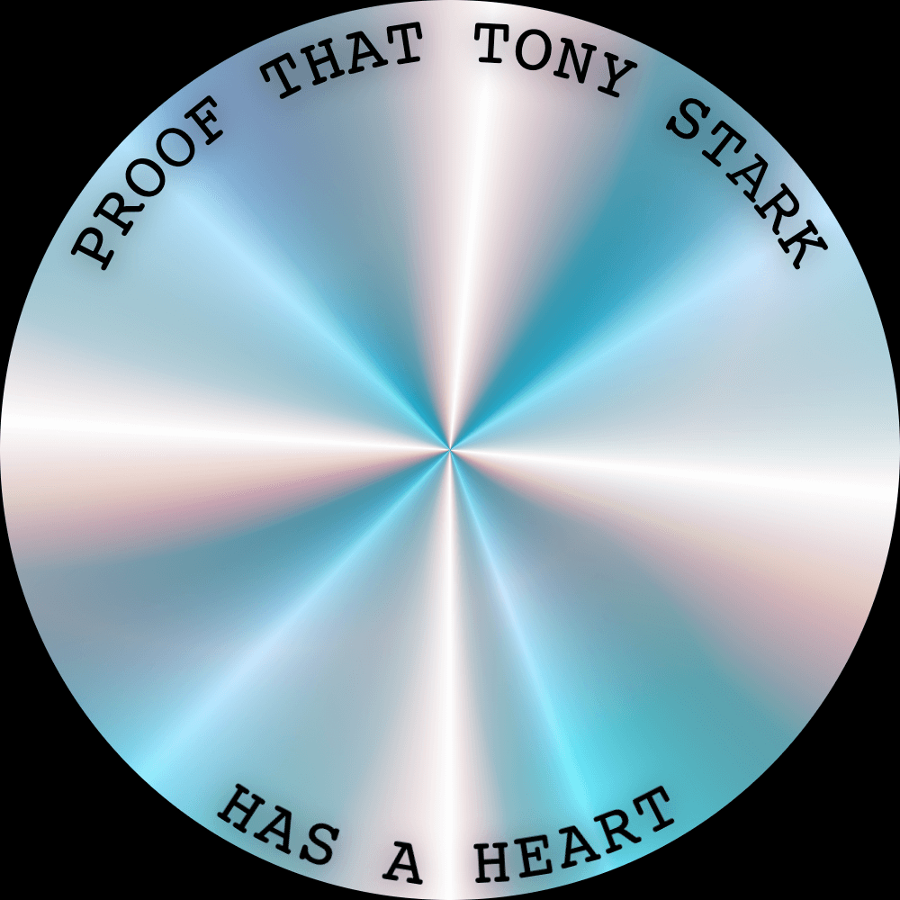
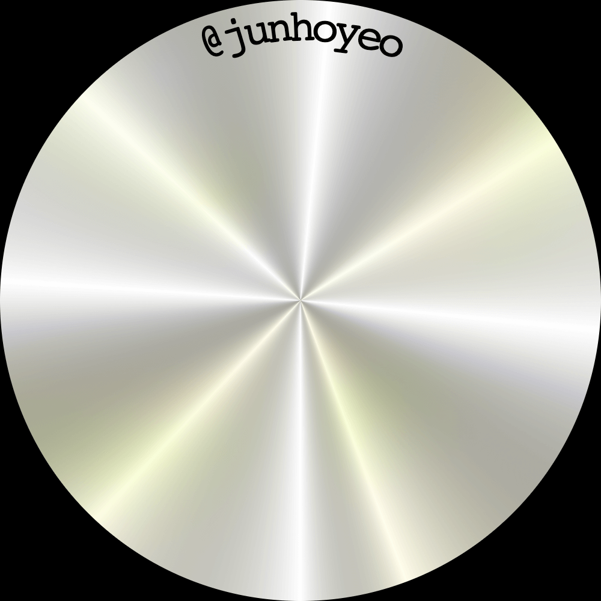
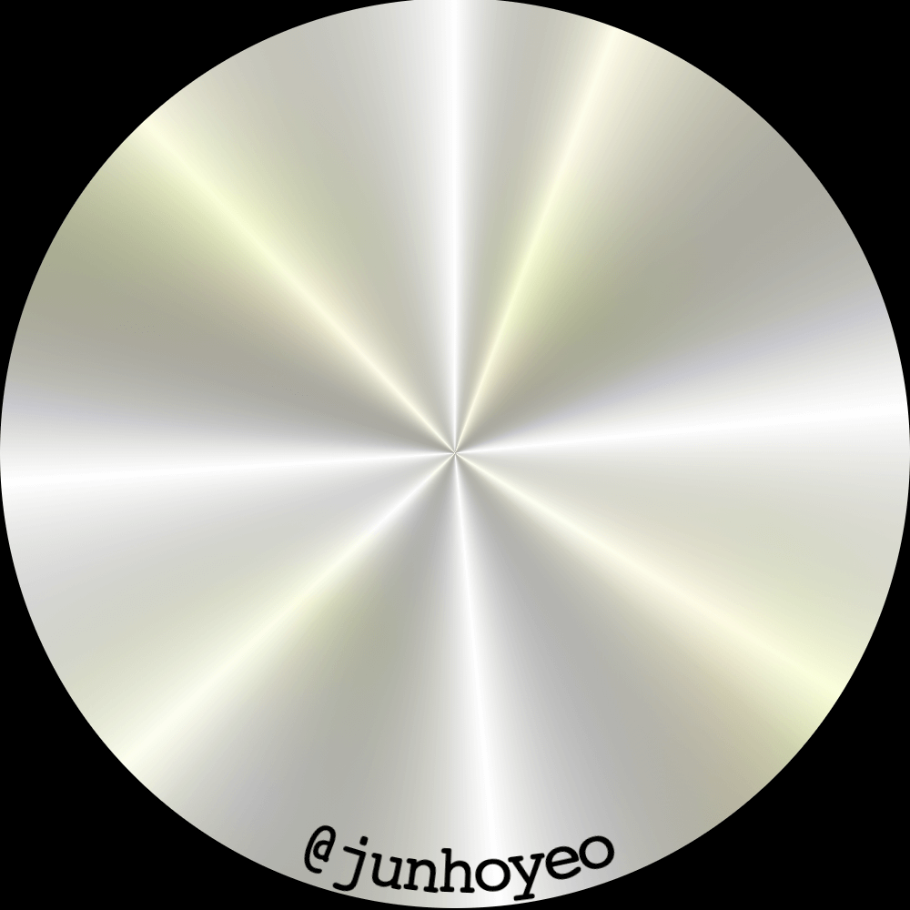

# arctext
<p align="center">
  
</p>

> 💿 UI component to draw curved text in circles

## 📦 Installation
Currently, this module is only available for React, but I have plans to support all major frontend libraries such as Vue and Svelte.

```bash
# ⎊ Arc Reactor(Cool!)
yarn add @arctext/react
```

## 🚀 Usage

### Basic Usage

<p align="center">
  
</p>

```tsx
import { ArcText } from '@arctext/react'

<ArcText text="@junhoyeo" width={500} characterWidth={4.8} />

// You can pass `radius` instead of `width`
<ArcText text="@junhoyeo" radius={250} characterWidth={4.8} />
```

### Upside-down(bottom text)

<p align="center">
  
</p>

```tsx
<ArcText
  text="@junhoyeo"
  upsideDown
  width={500}
  characterWidth={4.8}
/>
```

### Nested

<p align="center">
  
</p>

```tsx
<ArcText
  text="PROOF THAT TONY STARK"
  characterWidth={6}
  radius={250}
>
  <ArcText
    text="HAS A HEART"
    upsideDown // bottom text
    characterWidth={6}
    radius={250}
  />
</ArcText>
```
